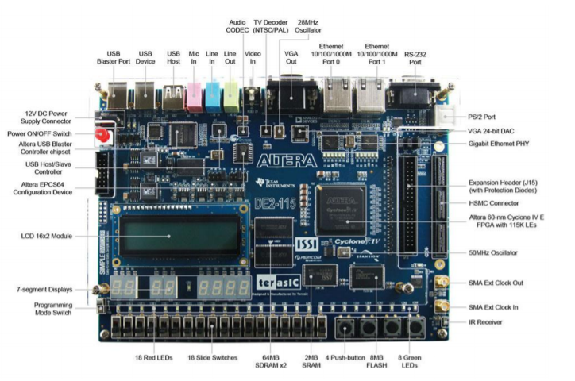
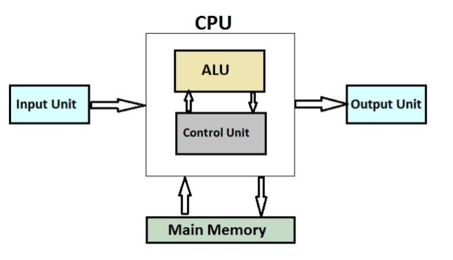
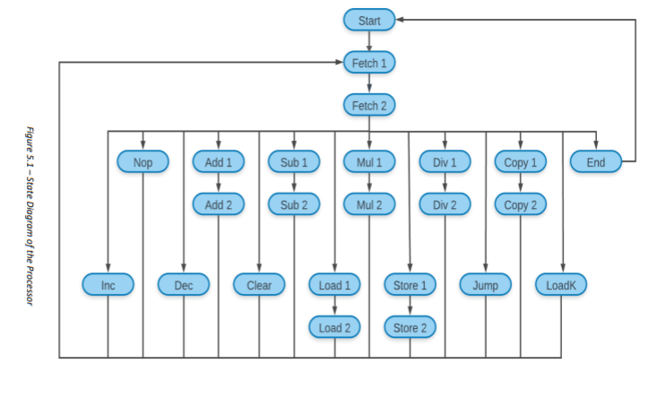
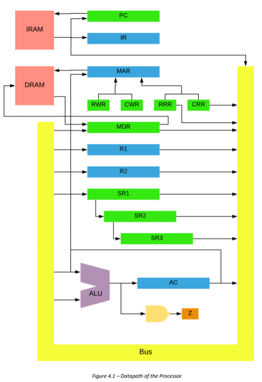

# Custom-processor-for-image-down-sampling
This repository contains a custom processor and an UART transceiver build using Verilog for the task of image downsampling

Required Software
>MATLAB

>Quartus

Hardware
>Altera DE2-115 development board

How to use

>following diagrams shows the architecture, state diagram and datapath of the processor

